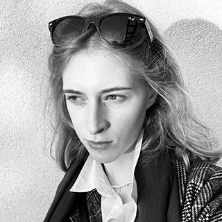
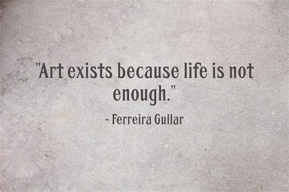
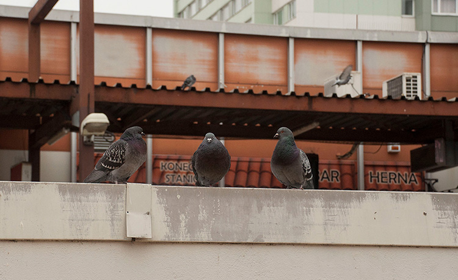
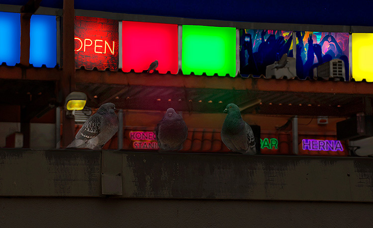
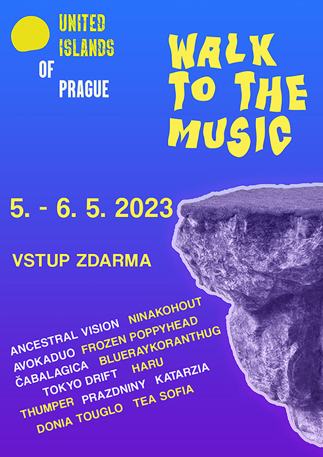
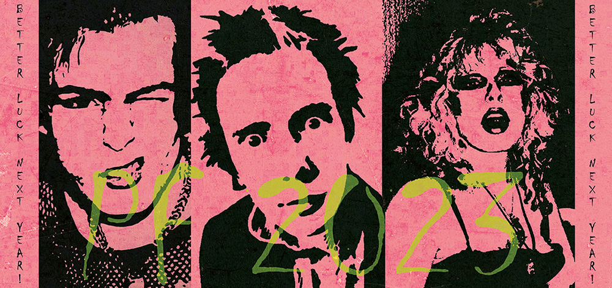
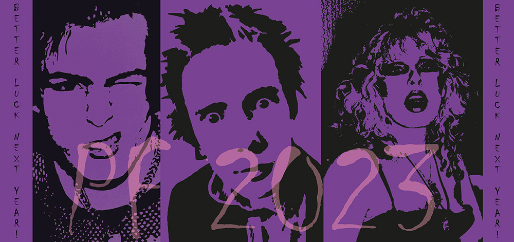
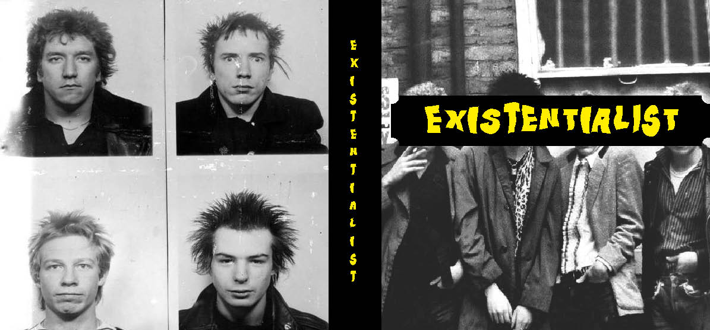
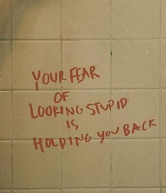

# First Impression

- [Presentation](Koukalova-draft-first-impression-2023.pdf)
- [About](#about)
- [Featured Projects](#featured-projects)

# About

## Adéla Koukalová

**Hi there! I'm Adela.** A graphic designer with attitude, style, and punk rock ethos.

I like to do things my way, unapologetically. Whenever I get to design something on my own, only then can I truly express myself without the constraints of awful ideas or rules. Artists are often misunderstood. We have a different perspective on things. On life.

And that‘s when it‘s my turn, an aspiring graphic designer, to prove them wrong and design something amazing.

# More about me

**I‘ve always been the quiet kid**,
ever since kindergarden. A very observant, though.
Since that time, I started noticing just how badly
people wanna fit in.
As much as I wanted to change and become another extroverted kid (peer pressure), I just couldn‘t. 
My introversion would always find its way back.  
A few years later - boom! Second year in college was
the milestone of it all. An insecure duckling has finally become a confident swan who doesn‘t give an F about other people‘s opinions. 
Not sure how exactly it happened, but I made it.
No more pleasing the others, just doing what makes me happy. Keeping my own style, no pressure to fit in. Whether it‘s just being an introvert or making art that‘s different from the rest. 
If you‘re quietly struggling like I once did, let me give you a simple advice: 
Don‘t be like everyone else. Be you. 

## Featured Projects

A few of my projects I did recently.

### Night Club Photomontage

- Kind of a milestone project I did back in high school. I got this idea to turn a plain photo with pidgeons into something cooler. Something a little bit different, bizarre enough for people to know that it's my style. So, I let my own imagination naturally flow without trying too hard. The whole working process of this was crucial to me. I learned a lot in terms of photo editing and being a little more spontaneous.

### Prague Music Festival Poster

- I made this in my second year of college. This was a bit of a challenge for me because of the abstract brief - music as an element connecting people outside. It was yet another long path full of many obstacles 
 making various concepts that ended up being discarded by my perfectionist self. But all the time I invested into it was worth it at the end.

### 2023 New Year’s Cards

- Another college assignment. I knew that most of the others will probably choose the easiest path with the card design. So naturally, my goal was to stand out with my concept as much as possible. I had fun while making these because we weren’t really limited to anything in terms of the design. I love the result of this because I got to create an unconventional, unique postcard without limiting myself to just make a plain New Year's card.

### Existentialist Book Cover

- A typography assignment. Besides the cover, I also designed this small poetry book including existentialist poems written by amateur poets. I had to think a lot about what photos could accompany the poems and somewhat reflect the meaning behind them. And then, I realized it. My favorite punk band, Sex Pistols, had this philosophy stemming deeply from their childhood and later influences. *We only live here and now. Do what you love.* That's what deeply resonates with me. I think the combination of these archaic poems and the legendary punk band was on point.

  ## *Thanks!*

  *And remember:*

  

  ## Check out my short essay based on the topic “One Word“:
- [Naive](naive.md)

