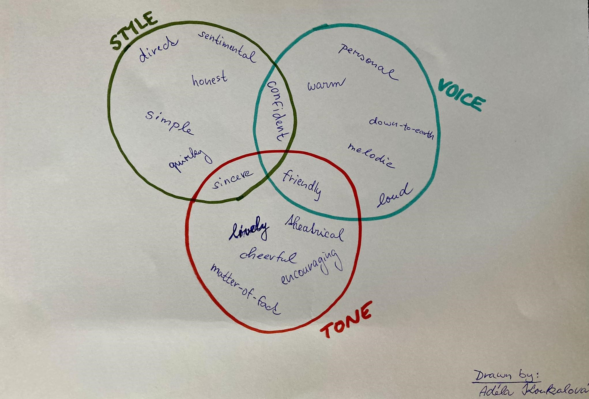

# Voice, Tone, and Style (a draft)

*Hi there, folks! I'm Adela. An ambitious graphic designer with attitude, style, and punk rock ethos ;)*

The following picture is my very first draft of the Venn diagram. It worked as a great foundation for this assignment.

 

## Voice

If I were to describe myself, it'd be honest, confident and down-to-earth.

Also, I don't like being late anywhere. I'm NEVER late, haha :D
While working on a project, I do my best to succeed.
And if it fails, then I do it again. But better! Because if you give up right in the beginning, your confidence'll go downhill. You don't want that, am I right or am I right? ;)

1. **Honest** - *I'm not a big fan of small talks. I prefer getting straight to the point.* 
2. **Confident** - *Over the years, I've figured that being a timid little mouse won't get you nowhere. So get out there and show everyone what type of resilient metal you're made of!* 
3. **Down-to-earth** - *Hands down, one of the best qualities to have. No pretending, just being genuine and reasonable!*

## Tone

Although I've become more relaxed over the years, there're times where I focus on the way I sound to others. I think it matters a lot whether you're mindful of the way you talk versus when you're spitting nonsense.

1. **Friendly** - *The last thing I want is to make my people feel like I hate their guts. Just smile and you'll notice how easily your voice adjusts to those shiny teeth of yours!*
2. **Encouraging** - *Life is tough sometimes. We all sometimes have days where the vibe's just off. Remember to support your people when they feel down. You might help them to feel better!*
3. **Witty** - *I believe that making your people laugh plays a huge part in gaining their trust. It might sound silly, but cracking a good joke here and there eases the atmosphere which helps you think more freely and efectively. Also, people will remember you easily!*

## Style

From time to time, I tend to complicate things that aren't complicated at all. That's why I've learned to use some of these “quirks” of mine to help me overcome this bad habit.

1. **Including my humor** - *I love my type of humor. Like when a person says something and it reminds me of a funny memory or a reference from my favorite show (like The Office).
Making people guess for a bit before explaining the context is always hilarious to me. They look at you as if you got completely insane at first. But then, they start laughing along with you.
I genuinely enjoy making people laugh. It gives me more confidence and I feel happy when someone acknowledges my personality through my humor!*
3. **Active voice** - *I am everything but a passive person. As an artist, I'm emotional and perceptive. I often struggle with just letting things be. I mean, you should fight for what you want, right? I want people to listen to what I have to say. I want them to know my energy and enthusiasm through my voice!*
4. **Specific** - *To avoid any misunderstandings, I tell people exactly what's on my mind. I make sure not to forget to anything important. What usually helps for me is writing it down beforehand. *

