# New visual identity of Theatre D21 

by Adéla Koukalová

15 April 2024

[Watch the video](images/thesis-lightning-talk-koukalova.mp4)

[Check the slides](images/thesis-lightning-talk-slides.pdf)

## Intro

Hi there! I'm Adela. 

Today I'd like to show you a concept for the new visual identity of Prague's alternative theatre D21. I chose it as a topic for my bachelor thesis.

## Why I chose this topic
So, you might ask yourself - why did she choose this particular topic? Well, let me explain.

I have always been a fan of going to the movies, theatre plays and even musicals! I'm pretty sure I was an actress or a singer in my past life... or both. Given the circumstances though, I'm doing graphic design in this lifetime.

But hey, that's pretty close to doing theatre, right? I mean, what are the odds of you getting to make a visual identity rebrand for a theatre? 

Well, six months ago while choosing the main topic for my thesis, it was pretty clear to me from the get-go. I knew I wanted to create something that's gonna be meaningful to me. 

Sure, I wasn't quite thrilled about the fact that I'll have to work on it day and night for six months straight. But I knew that at least, I should choose a topic that I'll like.

## The initial process
As I've mentioned before, I chose a visual identity rebrand for my thesis. I had no idea how much research you have to do before you can actually get to the fun part of creating the visuals!

The thing is, you have to spend a lot of time deep diving into the main competition on the market first. If you don't know your enemy's strengths and weaknesses, you can't even compete with them. The research was the hardest part of my thesis, as I didn't know where it was going. Sometimes, I didn't know where I was going either. It was a strange time for me. 

But, I got to know the competition of Theatre D21, both from Czech Republic and across Europe. It was pretty exciting! My brain had later become used to staying awake for longer periods of time. Which is useful when there's a deadline creeping behind your back. Not like you have a choice, but you get what I mean. Anyway, it helped me a lot to envision what should the new visual identity actually look like.

## Why I like Theatre D21
I chose Theater D21 because it has sooo much potential! 

Their main specialty is turning classic theatre plays into a modern setting. People can relate better to the characters this way. Also, it could spark an interest in them to start going to theatre more often! That's a cool goal for a theatre to have! I actually visited the theatre before I started with the research. The PR manager told me that this is pretty much what they're trying to do - make the classic theatre plays more fun!

The theatre's main financial profit are sponsorships, so their budget is generally lower. And so, they don't have endless possibilities to compete on the cultural market.

## The key visuals
But now to the lighter topic, I'm gonna show you everything I've designed for the practical part of the thesis.

The main part are the key visuals. I decided to keep the current logo, because I thought it could be a great foundation for the new visual identity.
It's these two simple lines coming off from the logo that later became the key part of it all. It works as this small house that lets in whatever the theatre has in stock in its repertoire. 

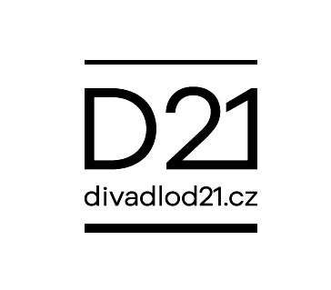 

For example, here are the promotional posters. The visual part are these two lines. In the between, there's a composition of a photo and a simple illustration. 
It's an abstract representation of both classic and modern elements in the theatre. 

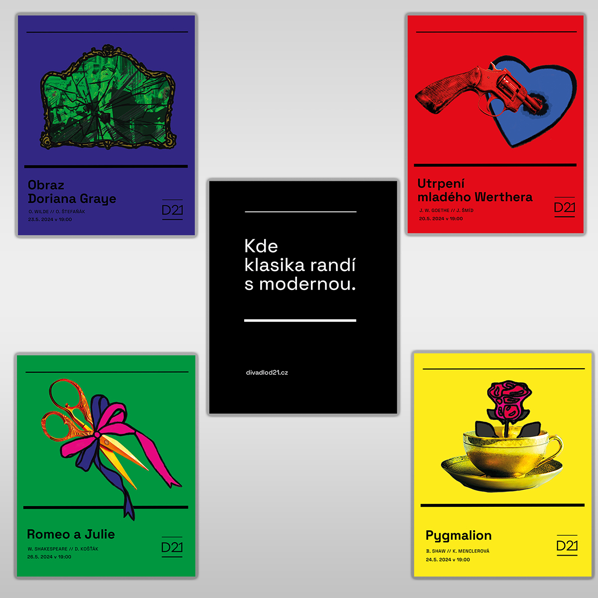 

This is how it'd look like on a citylight. 

 

Its vibrant colors are so hard to ignore that you'll have to take one look at it. 

Based on this, I came up with a new catchphrase for Theatre D21. “Where the classic dates the modern.” I used this in copywriting also. On social networks like Instagram and Facebook.

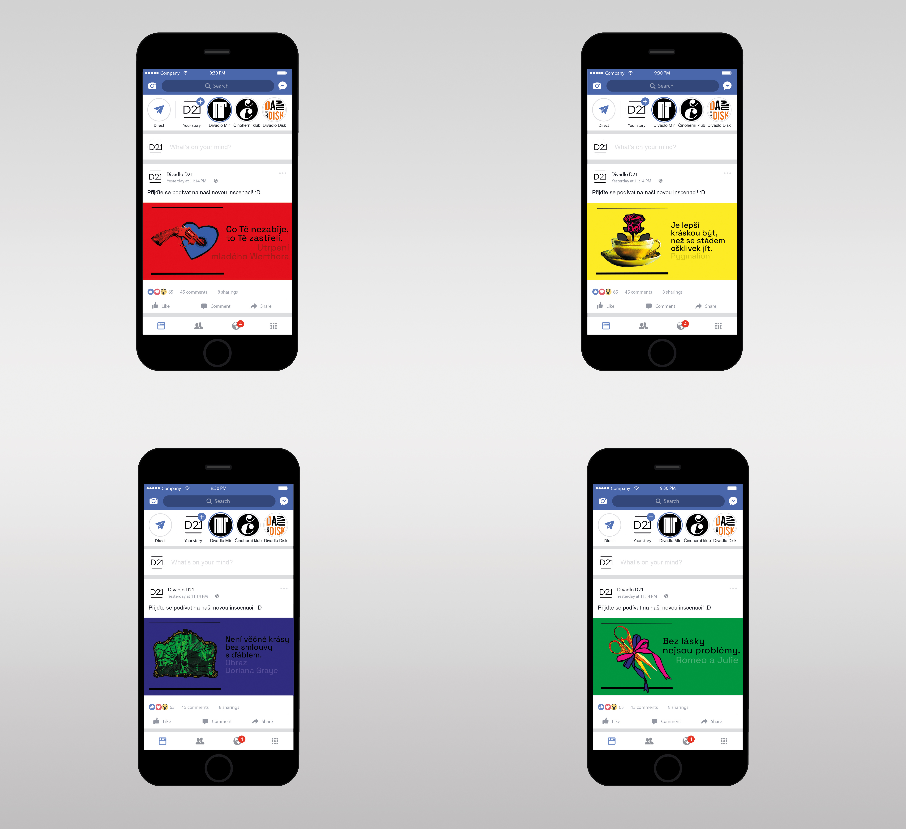 

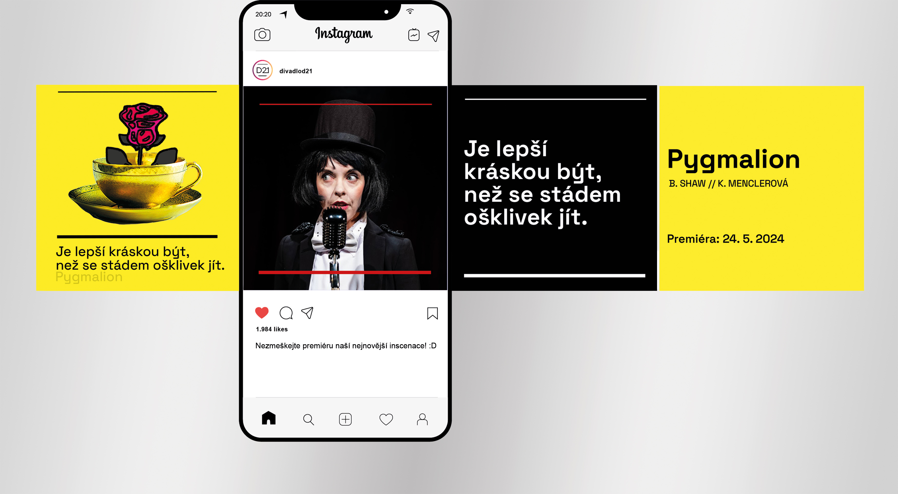 

## Copywriting
The visual part does pose as an eyecandy here. But, the catchphrases are still present while promoting each play. It's because it generally helps people. To get a better idea about not only the play itself, but also Theatre D21's personality. The Sorrows of Young Werther slogan from Goethe says this. “What doesn't kill you will shoot you.” 

It sounds brutal at first, I know! But, the main point is that it plays with the idea of combining an old saying with a witty, dry humor. This is a good example of how D21 could present itself as an independent institution. 

## Merchandise
Of course, I used the same concept on the merchandise as well. If this concept will ever become real, you guys can buy cool stuff! Like these T-shirts, hoodies, tote bags or even mugs!

The cool thing about these is that besides the visuals, they also have these catchphrases. They're different apart from the ones on socials and clothes, though. 

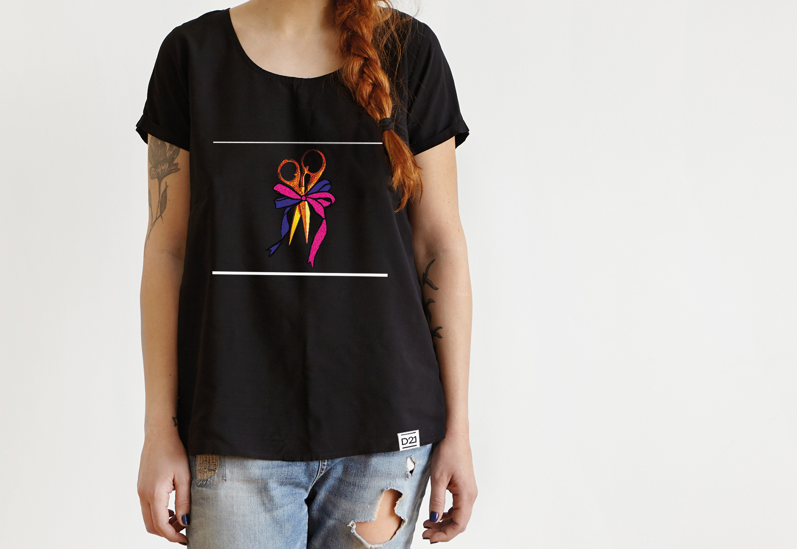 

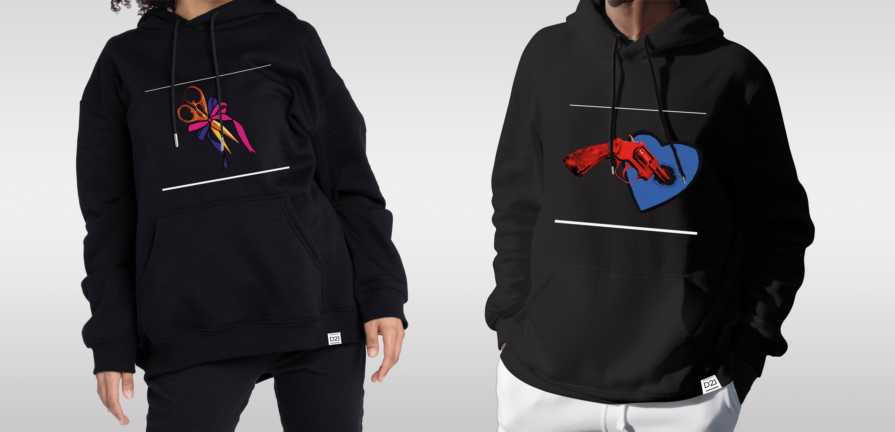 

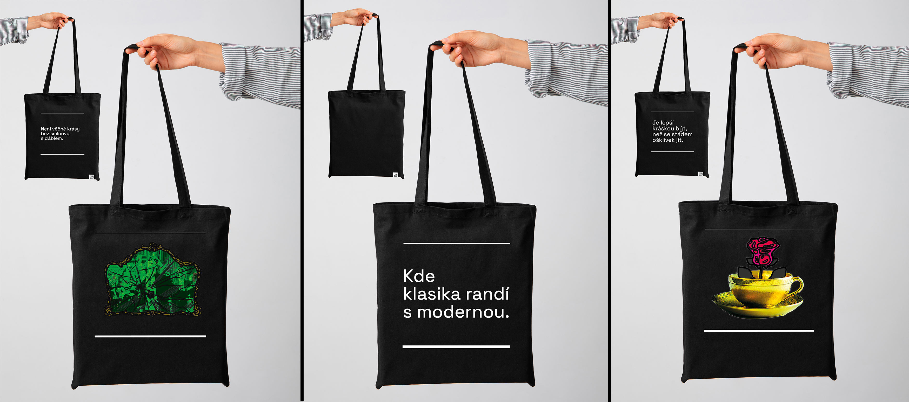 

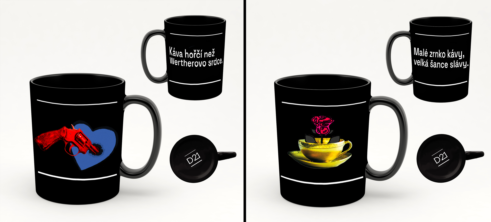 

For example, this mug says: “The coffee's bitter than Werther's heart.” It's meant to pose as a funny reference to let you know you're not drinking from a regular mug but from the *Theater D21 mug*! 

## Digital and printed promotion
Besides that, I also made these mockups. You know, how it'd look on a webpage, newsletter or even an annual report. Last but not least, I did this funky A5 theatre booklet with the newest plays in the repertoire.

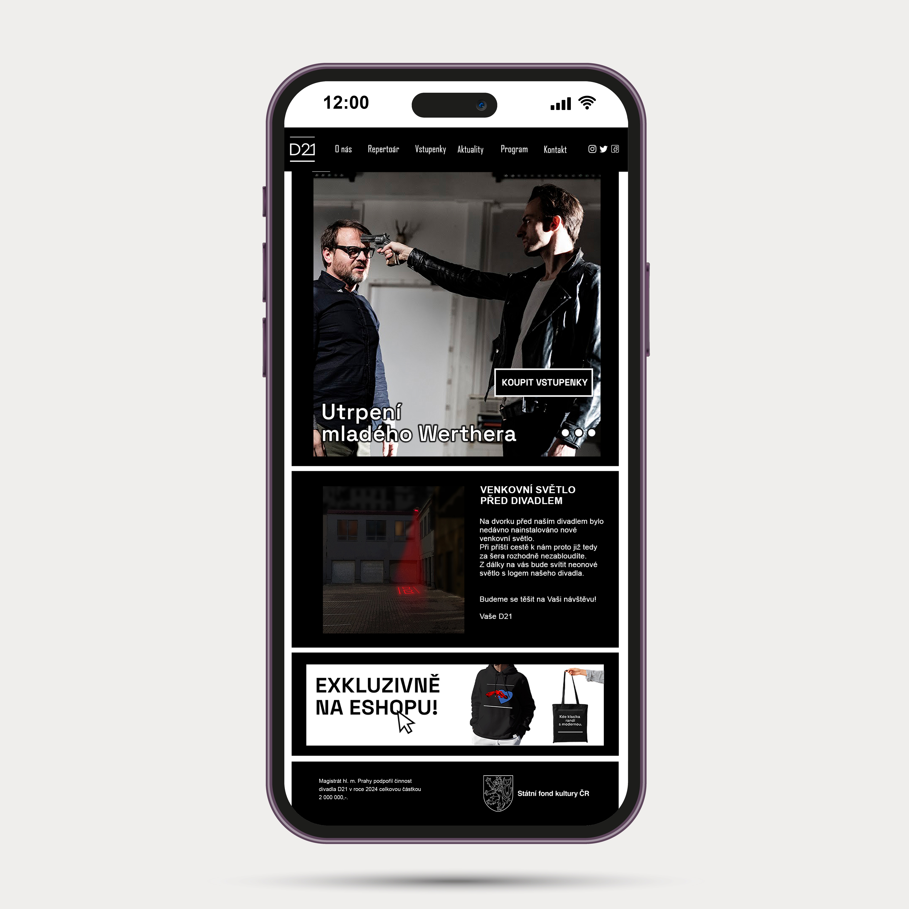 

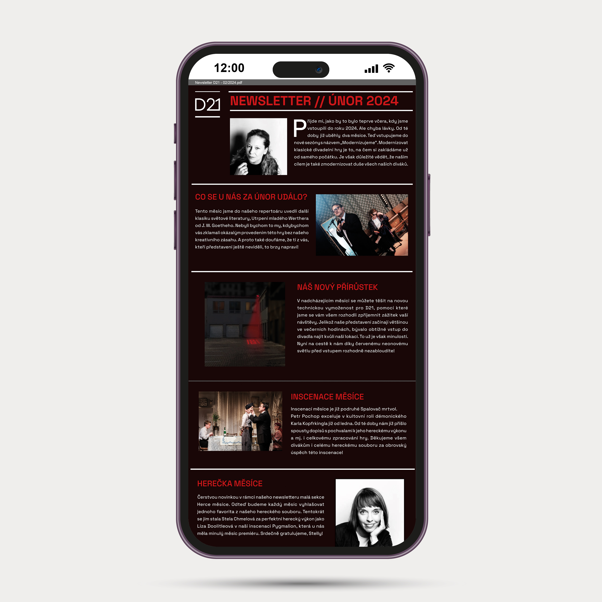 

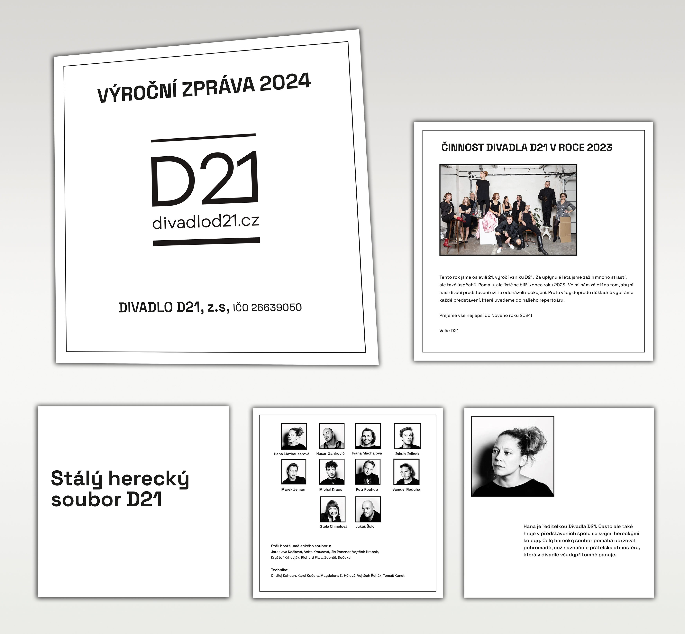 

 

## The main takeaway

So, that's it! That's everything I created. From the concept of a new visual identity of D21 to a new marketing strategy. 

Now, before I wrap this up. This was one rocky path. But, I still enjoyed it! Also, even if this is only a concept, I'm proud of it. 
And that's what matters the most to me as a graphic designer.

