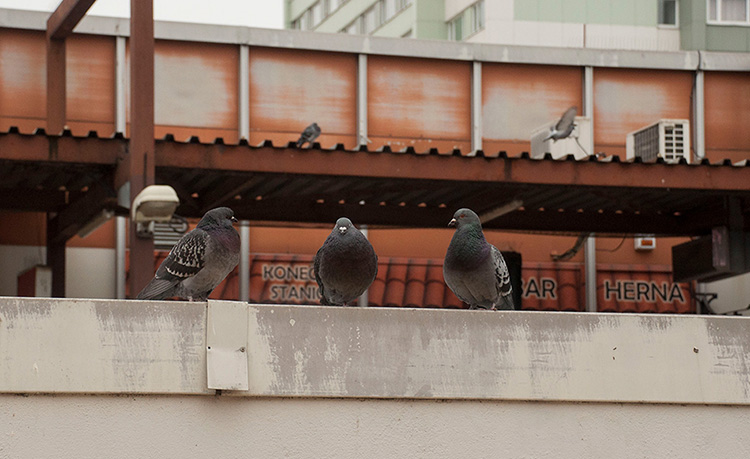
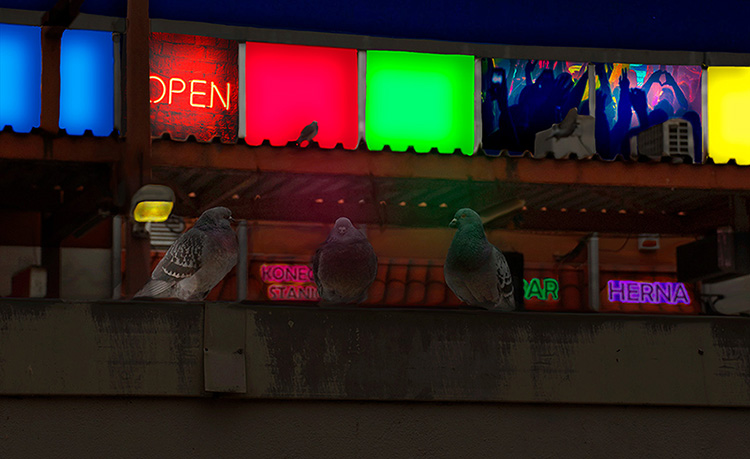
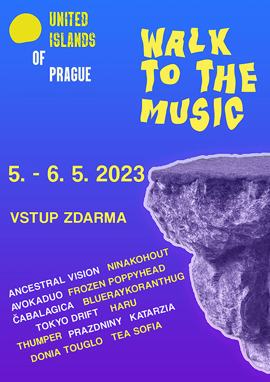
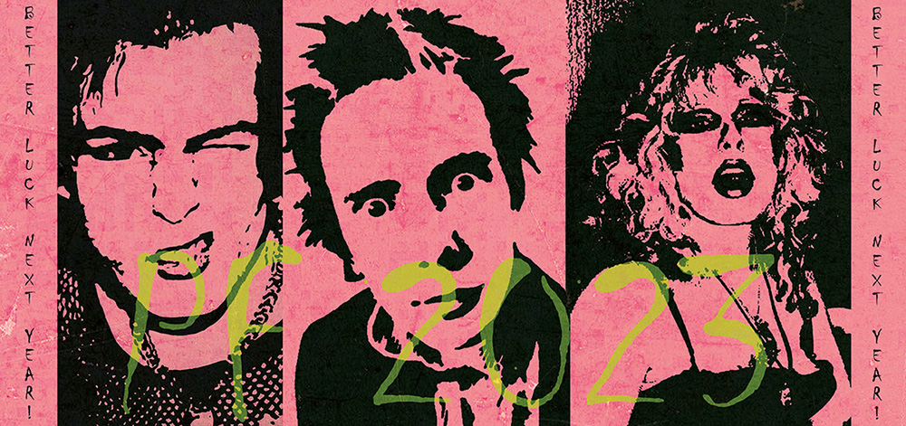
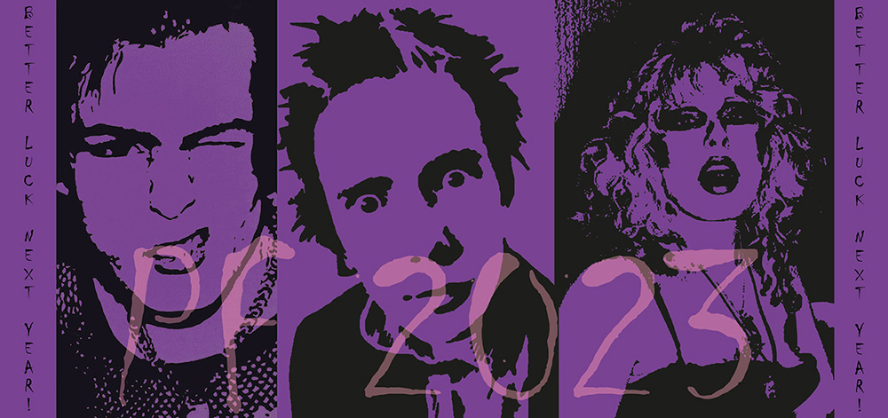

[About me](../about.md)

[Home](../index.md)

[Writing](../writing/index.md)

# Projects

- [Nightclub Photomontage](#night-club-photomontage)

  Kind of a milestone project I did back in high school. I got this idea to turn a plain photo with pidgeons into something cooler.

- [Prague Music Festival Poster](#prague-music-festival-poster)

  I made the concept for this festival in my second year of college. This was a bit of a challenge because of the abstract brief, but it turned out better than I thought.

- [2023 New Year’s Cards](#2023-new-years-cards)

  Another college assignment. I knew that most of the others will probably choose the easiest path with the card design.
  So naturally, my goal was to stand out with my concept as much as possible. I don't regret it one bit.

 
 - [Existentialist Book Cover](#existentialist-book-cover)

    A typography assignment. Besides the cover, I also designed this small poetry book including existentialist poems written by amateur poets. 

   
   ### Night Club Photomontage
   2021

   
   

- Kind of a milestone project I did back in high school. I got this idea to turn a plain photo with pidgeons into something cooler. Something a little bit different, bizarre enough for people to know that it's my style. So, I let my own imagination naturally flow without trying too hard. The whole working process of this was crucial to me. I learned a lot in terms of photo editing and being a little more spontaneous. 

 
 
  ### Prague Music Festival Poster
  2023

  

- I made this in my second year of college. This was a bit of a challenge for me because of the abstract brief - music as an element connecting people outside. It was yet another long path full of many obstacles - making various concepts that ended up being discarded by my perfectionist self. But all the time I invested into it was worth it at the end.
  

  ### 2023 New Year’s Cards
  2022

  
  

- Another college assignment. I knew that most of the others will probably choose the easiest path with the card design. So naturally, my goal was to stand out with my concept as much as possible. I had fun while making these because we weren’t really limited to anything in terms of the design. I love the result of this because I got to create an unconventional, unique postcard without limiting myself to just make a plain New Year's card.

 ### Existentialist Book Cover
 2023

 

 - A typography assignment. Besides the cover, I also designed this small poetry book including existentialist poems written by amateur poets. I had to think a lot about what photos could accompany the poems and somewhat reflect the meaning behind them. And then, I realized it. My favorite punk band, Sex Pistols, had this philosophy stemming deeply from their childhood and later influences. *We only live here and now. Do what you love.* That's what deeply resonates with me. I think the combination of these archaic poems and the legendary punk band was on point. 

  

  

   

   

    

